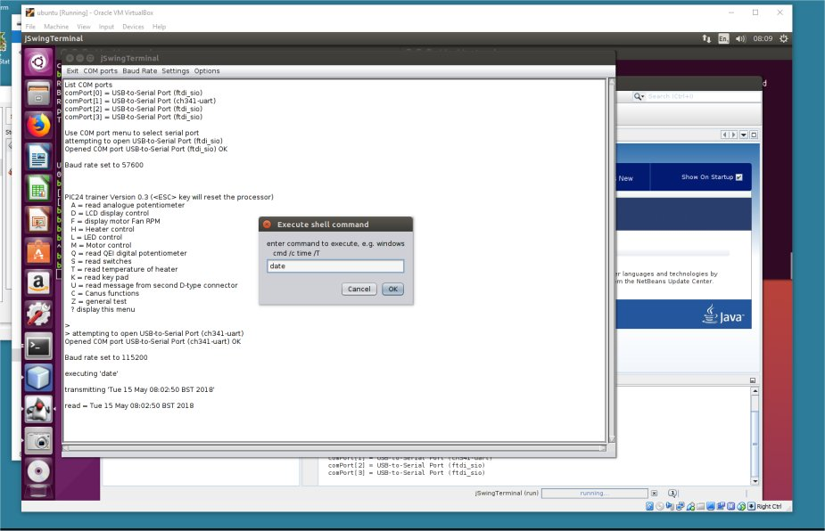

# JAVA_Terminal_Emullator
a terminal emulator implemented in Java Swing - runs under Windows and Linux

1. install Oracle Netbeans 
2. run NetBeans, click *File > Open Project* and open the *jSwingTerminalOptions* project
3. click *Run > Run Project (swing Terminal)*

the serial COM ports available will be displayed and added to the COM ports menu 

Select a COM port, baudrate, etc to communicate with the selected serial port, e.g. UNIX example

Using *Options > Execute Command*  a shell command may be executed and the output transmitted to the serial port

In the above image the terminal emulator is connected to an Arduino which echos the data transmited

The Unix shell command *date* has just been executed and **Tue 15 May 09:02:50 BST 2018** received and echoed by the arduino
